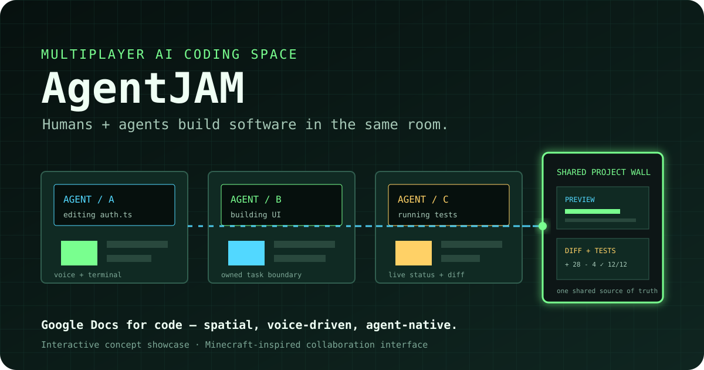

<div align="center">

**English | [中文](README.zh-CN.md)**

# ⛏️ AgentJAM

### The multiplayer room for humans and AI agents to build software together.

**在 Minecraft 里，把“多人 + 多个 AI Agent 一起写代码”变成一个真正共享的空间。**

AgentJAM explores a simple idea: when AI can write code faster than ever, the next bottleneck is no longer typing — it is **shared context, coordination, and visibility**.

<br/>

[](https://lavine888.github.io/AgentJAM-showcase/)
[](docs/ARCHITECTURE.md)
[](#what-this-repository-is)

`Minecraft-inspired spatial UI` · `Multi-agent collaboration` · `Voice + terminal` · `Shared project state`

<br/>

[](https://lavine888.github.io/AgentJAM-showcase/)

*One shared room. Multiple builders. Multiple AI agents. One project state.*

</div>

---

## Real project snapshots

These are **real screenshots from the original team-built AgentJAM prototype**, not mockups created later for this showcase repository.

<table>
<tr>
<td width="50%"></td>
<td width="50%"></td>
</tr>
<tr>
<td><b>Shared desktop view.</b> A real capture from the original AgentJAM build.</td>
<td><b>Inside the Minecraft world.</b> The project experience running in-world rather than as a standalone mockup.</td>
</tr>
<tr>
<td width="50%"></td>
<td width="50%"></td>
</tr>
<tr>
<td><b>Built, not rendered.</b> One of the original prototype scenes.</td>
<td><b>Working product surface.</b> A real state from the team project media set.</td>
</tr>
</table>

<div align="center">

**[▶ Watch the original AgentJAM screen recording](https://github.com/harrythentrepreneur/vibecode-together/blob/main/landing/videos/agentjam.mp4)**

<sub>Original project media from the team repository, shown here as part of Lavine's authorized project showcase.</sub>

</div>

---

## The problem: AI writes faster, teams desync faster

AI coding tools make an individual developer dramatically faster. But put several people — each with their own agent, terminal, branch and chat context — on the same fast-moving prototype, and a new problem appears:

> **Everyone can generate code quickly, but nobody has a clean shared view of what all the agents are doing.**

In a typical hackathon or product sprint, context is scattered across editors, chat windows, Git branches, screenshots, terminals and pull requests. The faster agents generate changes, the easier it becomes to lose track of:

- who is working on what;
- which version is currently the source of truth;
- what an agent just changed and why;
- whether the latest build still runs;
- where two agents are about to touch the same code;
- and how the team actually arrived at the final demo.

AgentJAM asks a different question:

**What if the project itself became a place the whole team could enter?**

---

## The big idea

AgentJAM turns AI coding collaboration into a **shared 3D workspace inspired by Minecraft**.

Each teammate gets an AI Agent workstation. You can walk up to a station, give instructions by voice or terminal, and see the agent's work reflected back into the shared room. A central project wall acts as the common source of truth — showing changes, previews, task state, tests and snapshots.

It is roughly:

> **Google Docs for code — but spatial, voice-driven and AI-powered.**

Instead of every developer privately operating an AI assistant, the team experiences **humans + agents working inside the same visible project state**.

---

## A hackathon session in five moves

Picture a three-person team trying to ship a demo before midnight.

| Step | In AgentJAM | What it solves |
| --- | --- | --- |
| **01 · Enter the room** | The project becomes a shared Minecraft-style collaboration space. | Everyone starts from the same visible context. |
| **02 · Take a workstation** | Each teammate owns an AI Agent station and a clear task boundary. | Makes ownership and parallel work legible. |
| **03 · Give an instruction** | Use voice for fast delegation or terminal input for precise control. | Keeps interaction lightweight without hiding the work. |
| **04 · Watch the project wall** | Diffs, previews, task progress, tests and conflict signals appear in the shared space. | Turns invisible agent activity into team-visible events. |
| **05 · Save a snapshot** | Important milestones become replayable project states. | Makes rollback, demo storytelling and retrospectives easier. |

The goal is simple: **replace “whose local version are we looking at?” with one room that always knows what the team is building.**

<table>
<tr>
<td width="50%"></td>
<td width="50%"></td>
</tr>
</table>

---

## Minecraft is not just the skin

The Minecraft language maps directly onto the collaboration model:

| World element | Collaboration meaning |
| --- | --- |
| 🧱 **Blocks** | Modular tasks and pieces of the software system |
| 🔴 **Redstone** | Real-time synchronization and event flow |
| 🛠️ **Crafting table** | Combining ideas, prompts, code and agent capabilities into a feature |
| 💎 **Diamond ore** | High-value code changes or important discoveries |
| 🟣 **Portal** | Entering a shared project context from separate local tools |
| 💥 **Creeper warning** | Potential code conflicts before they explode at merge time |

The point is not to put a Minecraft texture on an IDE. The point is to make abstract coordination **physical, visible and intuitive**.

---

## Core product concepts

### 1. Personal AI Agent workstations

Each teammate has a spatially distinct workstation connected to their task, model context and coding session. Instead of asking “what are you doing?”, teammates can see the active area of work directly.

### 2. Voice + terminal as dual interfaces

Small instructions can be spoken naturally; complex work can still be controlled precisely through a terminal-style interface. AgentJAM does not try to replace developer tools — it gives them a shared spatial layer.

### 3. The central project wall

The wall is the room's source of truth: code Diff, running preview, task state, logs, tests and important decisions can all be surfaced in one place.

### 4. Conflict awareness

When multiple agents begin touching the same area of the project, the room can expose that collision before it becomes a painful late-stage merge problem.

### 5. Replayable snapshots

Hackathons, teaching and fast product sprints are not only about the final artifact. Snapshots preserve the path — what changed, when it changed, and how the team reached the result.

### 6. Presence

There is a surprisingly important difference between “three people are editing the same repo” and “three people feel like they are building in the same workshop.” AgentJAM is an experiment in making that collaboration feel present again.

<table>
<tr>
<td width="50%"></td>
<td width="50%"></td>
</tr>
</table>

---

## What the showcase demonstrates

This repository is an **interactive product concept**, not a claim that a full multiplayer coding runtime is already production-ready.

The current showcase makes the interaction model concrete:

- personal AI workstations with visible task ownership;
- a voice + terminal interaction model;
- a central project wall for preview, Diff, tests and status;
- spatial metaphors for synchronization and conflict risk;
- snapshot/replay as a first-class collaboration primitive;
- a Minecraft-style interface where the visual language maps to product behavior.

<table>
<tr>
<td width="50%"></td>
<td width="50%"></td>
</tr>
</table>

<div align="center">

### ▶ [Open the interactive showcase](https://lavine888.github.io/AgentJAM-showcase/)

</div>

---

## Why this matters

AI coding is moving the bottleneck.

When code generation becomes cheap, the scarce resource becomes **coordination**: deciding what should be built, keeping agents aligned, understanding parallel changes, spotting collisions early, and preserving a coherent project state.

AgentJAM is a design exploration around that shift.

It does not ask how to make one AI programmer faster.

It asks:

> **What should the workspace look like when an entire team is collaborating with AI programmers at the same time?**

---

## Conceptual architecture

```text
[ Human teammates ]
        │
        │  voice / terminal / in-world interaction
        ▼
[ Shared Minecraft-style workspace ]
        │
        ├── Agent workstation A ──► coding agent / task context
        ├── Agent workstation B ──► coding agent / task context
        ├── Agent workstation C ──► coding agent / task context
        │
        ▼
[ Collaboration runtime ]
        ├── room + presence state
        ├── task ownership
        ├── event stream
        └── conflict awareness
        │
        ▼
[ Shared project state ]
        ├── isolated worktrees
        ├── code changes / Diff
        ├── running preview
        ├── tests + logs
        ├── merge checkpoints
        └── historical snapshots
        │
        ▼
[ Central project wall ]
```

The intended production model keeps agents isolated while making their work visible to the whole room. A collaboration runtime normalizes status and events; a project runtime owns Git worktrees, previews, tests, snapshots and merge checkpoints.

📖 **[Read the full architecture note →](docs/ARCHITECTURE.md)**

---

## The first real vertical slice

Before building a giant Minecraft platform, the core thesis can be tested with one narrow loop:

> **2 humans → 2 isolated agent worktrees → 1 shared preview wall → visible Diffs → conflict warning → merge checkpoint.**

If that loop feels materially better than “two people each running an agent and meeting later in Git,” then the spatial layer is earning its keep.

A practical implementation would likely separate the system into:

| Layer | Responsibility |
| --- | --- |
| **3D client** | presence, workstations, project wall, spatial interactions |
| **Collaboration runtime** | rooms, users, events, ownership, conflict signals |
| **Agent adapters** | launch/control coding agents and normalize their state |
| **Project runtime** | Git worktrees, builds, tests, previews, snapshots, rollback |
| **Realtime transport** | broadcast project and agent events to every participant |

---

## Who it is for

**Hackathon teams** — parallelize aggressively without completely losing the shared story of the build.

**AI-native product teams** — coordinate several humans and several coding agents around one fast-moving prototype.

**Programming education** — let instructors observe not only the final code, but how students divide tasks, prompt agents, debug and recover from mistakes.

**Remote creative coding teams** — create a stronger feeling of co-presence than a stack of tabs, calls and pull requests.

---

## Run the showcase locally

The current demo is deliberately lightweight: **one static HTML page, no framework and no build step**.

```bash
# Clone
git clone https://github.com/lavine888/AgentJAM-showcase.git
cd AgentJAM-showcase

# Serve locally
python3 -m http.server 8000

# Open http://localhost:8000
```

You can also open `index.html` directly in a browser, but a local HTTP server is the most reliable way to load the local font assets.

---

## What this repository is

`AgentJAM-showcase` is the **interactive showcase / portfolio presentation layer** for the AgentJAM concept.

```text
AgentJAM-showcase/
├── index.html                  interactive GitHub Pages showcase
├── assets/
│   └── agentjam-hero.svg      README hero visual
├── docs/
│   └── ARCHITECTURE.md        intended production architecture
├── _shared/
│   └── fonts/                  local presentation fonts
├── .nojekyll                   GitHub Pages static-asset support
├── README.md                   English project story + documentation
└── README.zh-CN.md             Chinese README
```

The live page is intentionally designed like a Minecraft HUD / collaborative coding room so the product idea can be understood without requiring the full underlying system to be running.

---

## Roadmap

- [x] Interactive product showcase
- [x] Minecraft-native collaboration language
- [x] Product architecture and event model
- [ ] Realtime multi-user room state
- [ ] Coding-agent workstation adapter
- [ ] Git worktree isolation per agent
- [ ] Shared live preview + Diff wall
- [ ] Pre-merge conflict awareness
- [ ] Snapshot / replay timeline
- [ ] Minecraft/Fabric proof of concept

---

## Project context & attribution

> **AgentJAM was a team co-created project.**

This repository presents the project from **Lavine's perspective as a project participant/contributor** and serves as a personal showcase of the work. It is **not intended to claim sole authorship or exclusive ownership of the original team project**.

Lavine has the right / permission to showcase the project and related outcomes in a portfolio context. Credit for the original project belongs to the team members who contributed to its creation.

This repository primarily contains a separately maintained presentation layer and documentation used to communicate the concept, interaction model and product thinking around AgentJAM.

The original AgentJAM screenshots and recording shown throughout this README come from the team project media set and are included here for portfolio presentation under that showcase permission.

If additional team credits or links to the original collaborative materials are published later, they can be listed here explicitly.

---

## Showcase note

AgentJAM is presented here as a **creative prototype / product concept**. Some interactions described in the product vision represent the intended system behavior and should not be interpreted as claims that every production capability is fully implemented in this showcase repository.

Minecraft is a trademark of Mojang Studios / Microsoft. AgentJAM is an independent creative project and is not affiliated with or endorsed by Mojang Studios or Microsoft.

---

<div align="center">

### Coding agents are already fast. The next problem is making them work together.

<br/>

[](https://lavine888.github.io/AgentJAM-showcase/)

**[◆ Architecture](docs/ARCHITECTURE.md)** · **[⌘ View source](index.html)** · **[中文](README.zh-CN.md)**

</div>