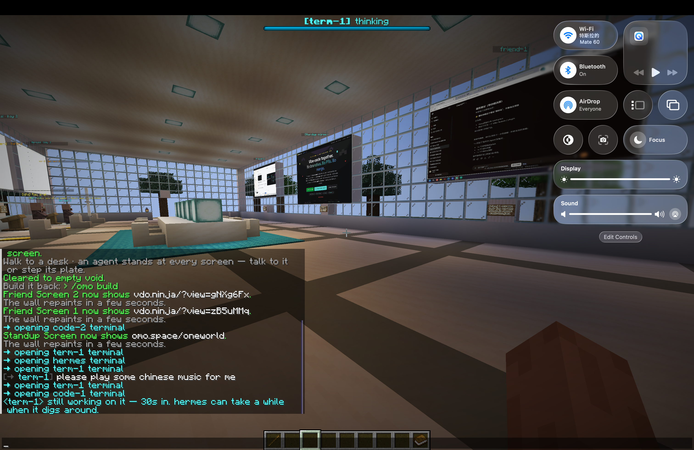
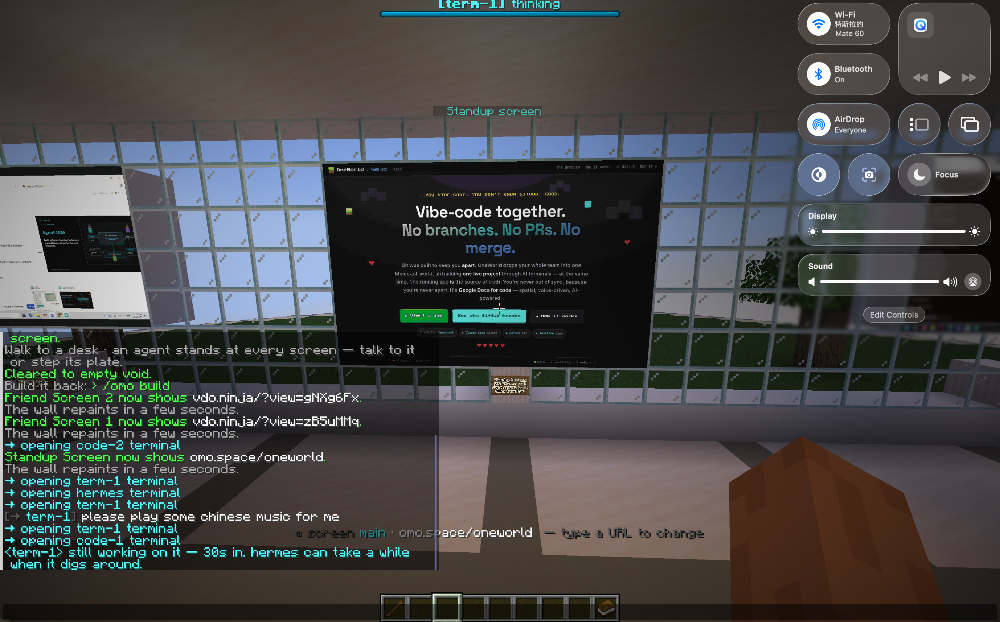
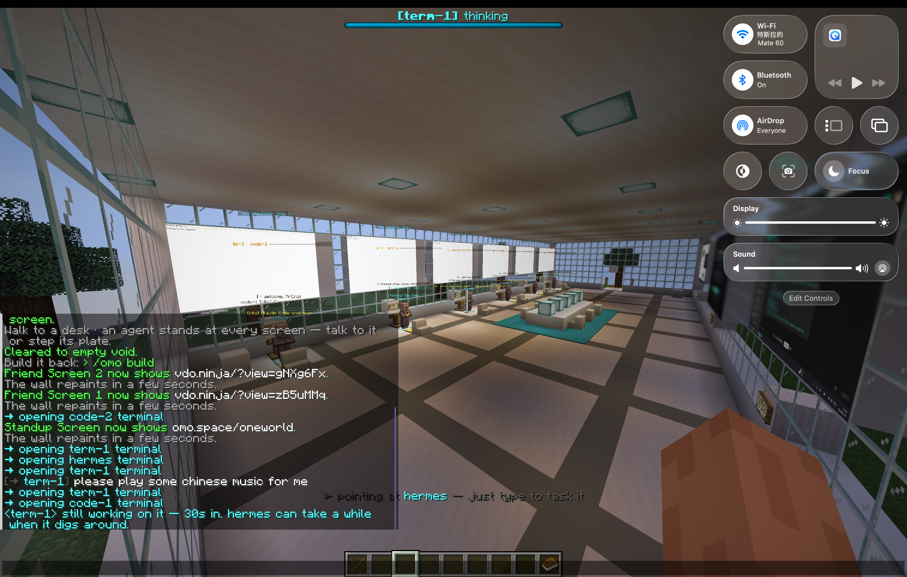
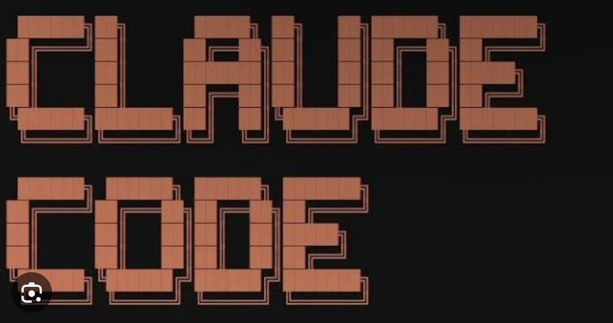
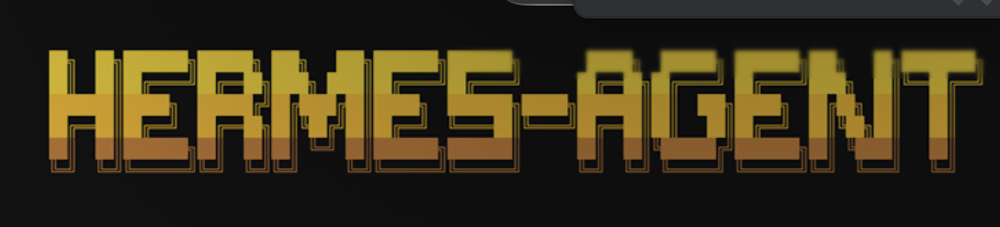
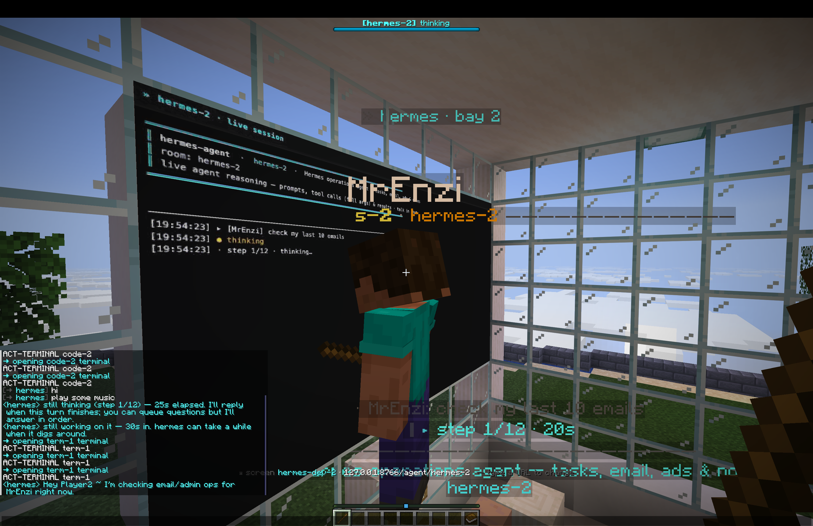
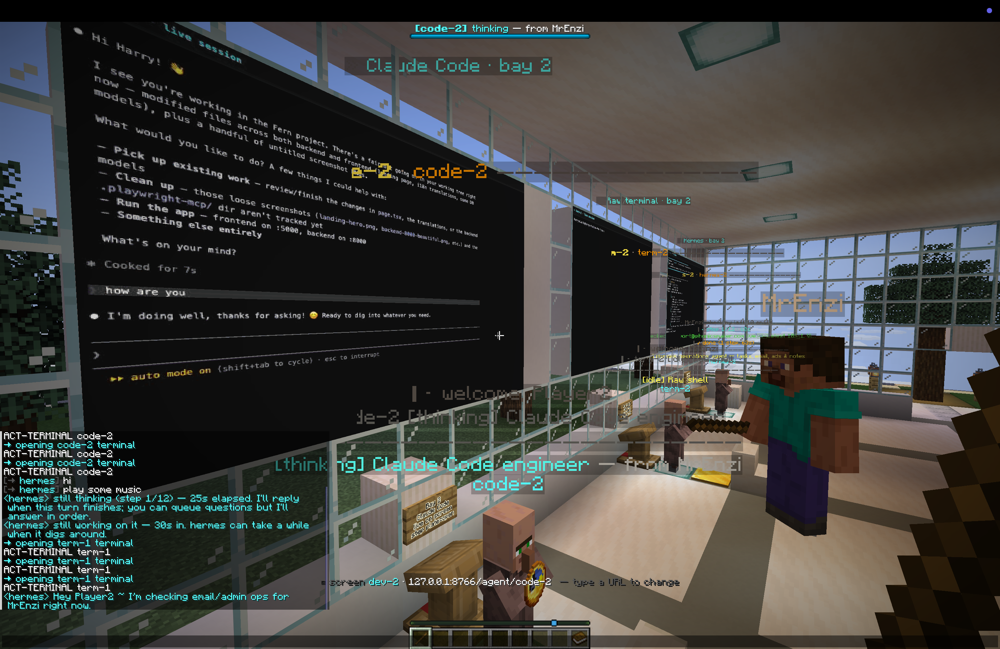
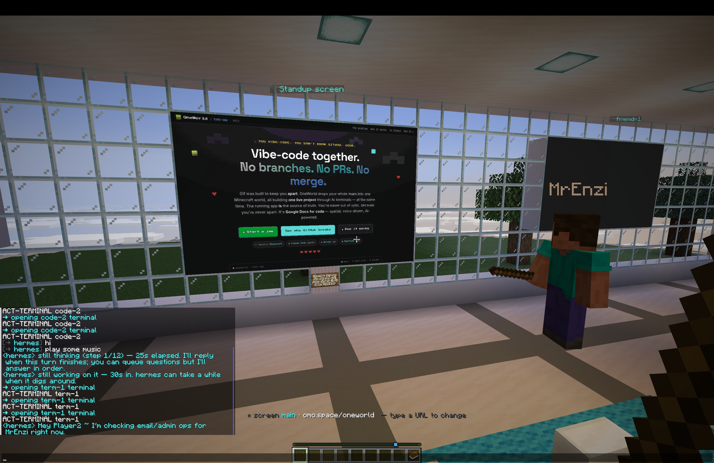
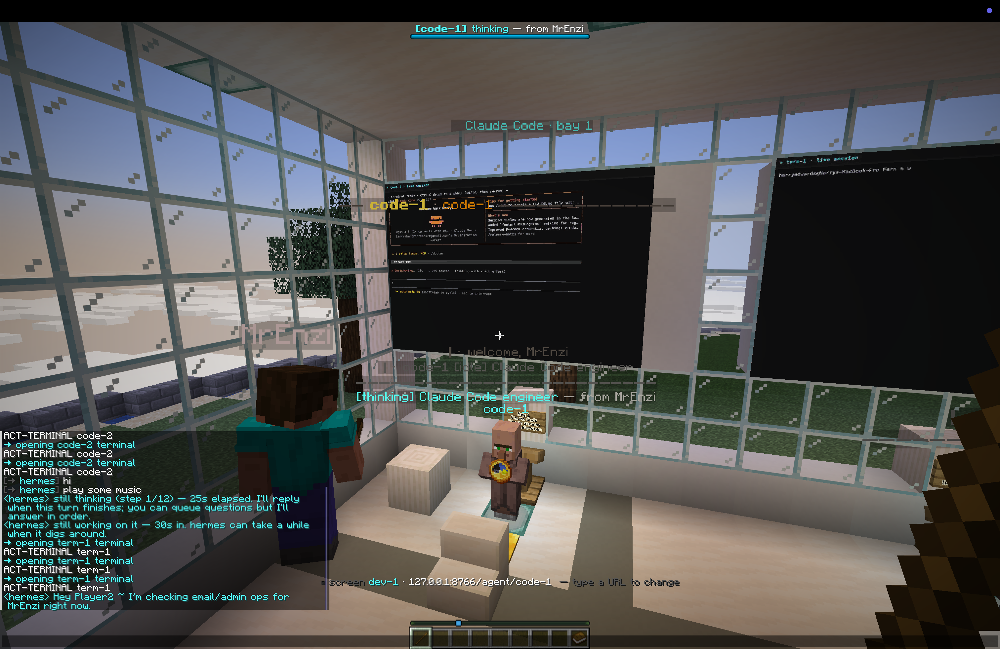
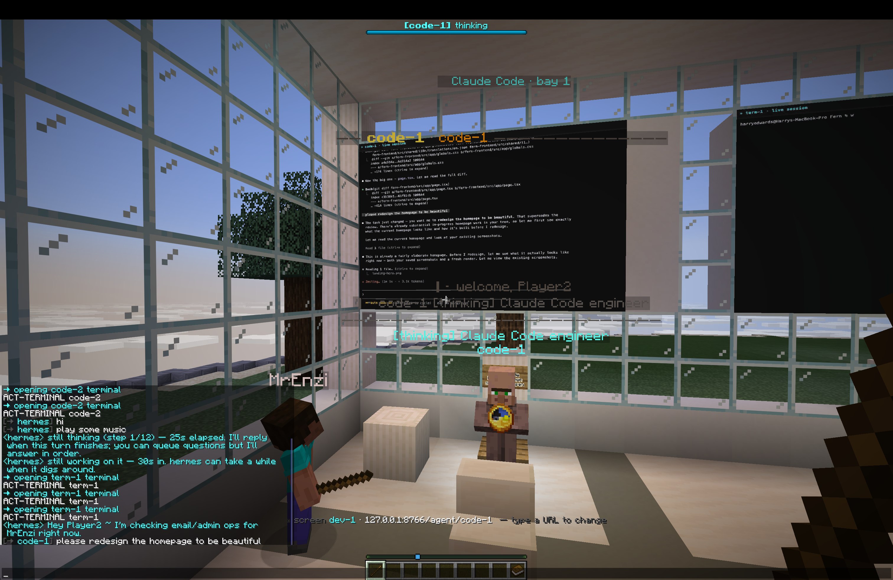

<div align="center">

**[English](README.md) | 中文**

# ⛏️ AgentJAM

### 让人类与 AI Agent 在同一个空间里一起构建软件。

**在 Minecraft 里，把“多人 + 多个 AI Agent 一起写代码”变成一个真正共享的空间。**

AgentJAM 探索的是一个很简单的问题：当 AI 写代码越来越快，下一个真正的瓶颈可能已经不再是“敲代码”，而是 **共享上下文、协作协调与过程可见性**。

<br/>

[](https://lavine888.github.io/AgentJAM-showcase/)
[](docs/ARCHITECTURE.md)
[](#这个仓库是什么)

`Minecraft 风格空间界面` · `多 Agent 协作` · `语音 + 终端` · `共享项目状态`

<br/>

[](https://lavine888.github.io/AgentJAM-showcase/)

*一个共享房间。多个开发者。多个 AI Agent。一个共同的项目状态。*

</div>

---

## 真实项目截图

下面这些是**当时团队共创 AgentJAM 原型的真实项目截图**，不是后来为了这个 Showcase 临时补出来的概念 Mockup。

<table>
<tr>
<td width="50%"></td>
<td width="50%"></td>
</tr>
<tr>
<td><b>共享桌面视图。</b> 来自原始 AgentJAM 项目构建过程的真实画面。</td>
<td><b>Minecraft 世界内运行。</b> 项目体验真正进入游戏世界，而不是一张独立的概念效果图。</td>
</tr>
<tr>
<td width="50%"></td>
<td width="50%"></td>
</tr>
<tr>
<td><b>不是概念渲染图。</b> 来自当时真实原型的一帧。</td>
<td><b>真实产品界面。</b> 来自团队项目的原始媒体素材。</td>
</tr>
</table>

<div align="center">

**[▶ 查看原始 AgentJAM 屏幕录制](assets/agentjam/agentjam.mp4)**

<sub>原始项目媒体来自团队项目仓库，并基于 Lavine 对该项目成果的展示权用于个人项目展示。</sub>

</div>

---

## 问题：AI 写得越快，团队反而越容易失去同步

AI 编程工具正在显著提高单个开发者的产出速度。但当一个快速迭代的项目里同时出现几个人，而且每个人都有自己的 Agent、终端、分支和聊天上下文时，一个新的问题就出现了：

> **每个人都能很快生成代码，但团队很难拥有一个清晰、统一的视角，知道所有 Agent 此刻到底在做什么。**

在典型的黑客松或产品冲刺里，上下文往往散落在编辑器、聊天窗口、Git 分支、截图、终端和 Pull Request 之间。Agent 生成代码越快，团队越容易失去对这些事情的掌控：

- 谁正在负责什么；
- 当前到底以哪个版本为准；
- 某个 Agent 刚刚改了什么、为什么改；
- 最新版本现在还能不能运行；
- 哪两个 Agent 可能即将修改同一片代码；
- 团队最终又是怎样一步步走到这个 Demo 的。

AgentJAM 因此提出了一个不同的问题：

**如果“项目本身”变成一个整个团队都可以走进去的地方，会怎么样？**

---

## 核心想法

AgentJAM 把 AI 编程协作变成一个 **受 Minecraft 启发的共享 3D 工作空间**。

每位成员都有自己的 AI Agent 工位。你可以走到某个工位前，通过语音或终端下达任务，并直接看到 Agent 的工作如何反馈到共享房间里。房间中央的“项目墙”充当共同的事实来源，统一展示代码变更、运行预览、任务状态、测试结果和历史快照。

你可以把它粗略理解成：

> **Google Docs for code —— 但它是空间化的、语音驱动的，而且由 AI Agent 参与协作。**

它不再是“每个开发者各自偷偷操作一个 AI 助手”，而是让 **人类 + AI Agent 共同存在于同一个可见的项目状态中**。

---

## 一场黑客松，用五步完成协作

想象一个三人团队，要在午夜前把 Demo 做出来。

| 步骤 | 在 AgentJAM 中 | 解决什么问题 |
| --- | --- | --- |
| **01 · 进入房间** | 项目被转化成一个共享的 Minecraft 风格协作空间。 | 所有人从同一个可见上下文开始。 |
| **02 · 占用工位** | 每位成员拥有自己的 AI Agent 工位，并明确任务边界。 | 让任务归属和并行工作变得清晰可见。 |
| **03 · 发出指令** | 轻量任务直接用语音，复杂任务通过终端精确控制。 | 保持交互轻量，同时不把执行过程藏起来。 |
| **04 · 看项目墙** | Diff、运行预览、任务进度、测试结果与冲突信号同步出现在共享空间。 | 把不可见的 Agent 活动变成团队共同可见的事件。 |
| **05 · 保存快照** | 关键节点被保存为可以回放的项目状态。 | 更方便回滚、Demo 展示与项目复盘。 |

目标其实很简单：**不再问“我们现在看的到底是谁电脑里的版本？”，而是让一个共享房间始终知道团队正在构建什么。**

<table>
<tr>
<td width="50%"></td>
<td width="50%"></td>
</tr>
</table>

---

## Minecraft 不只是视觉皮肤

AgentJAM 里的 Minecraft 元素会直接映射到协作逻辑：

| 世界元素 | 对应的协作含义 |
| --- | --- |
| 🧱 **方块** | 模块化任务和软件系统中的独立组成部分 |
| 🔴 **红石** | 实时同步与事件流 |
| 🛠️ **工作台** | 把想法、Prompt、代码与 Agent 能力组合成一个功能 |
| 💎 **钻石矿** | 高价值代码变更或关键发现 |
| 🟣 **传送门** | 从各自独立的本地工具进入同一个共享项目上下文 |
| 💥 **苦力怕预警** | 在合并爆炸之前提前暴露潜在代码冲突 |

重点不是给 IDE 套一层 Minecraft 材质，而是把原本抽象的协作过程变得 **具象、可见、直觉化**。

---

## 核心产品概念

### 1. 个人 AI Agent 工位

每位成员都有一个空间上独立的 Agent 工位，它与对应的任务、模型上下文和代码会话绑定。团队成员不必反复问“你现在做到哪了？”，因为当前工作区域本身就是可见的。

### 2. 语音 + 终端双入口

简单任务可以直接自然语言说出来，复杂任务仍然可以通过终端精确控制。AgentJAM 并不试图替代开发者已有的工具，而是在这些工具之上增加一个共享的空间协作层。

### 3. 中央项目墙

项目墙是整个房间的共同事实来源：代码 Diff、运行预览、任务状态、日志、测试结果和关键决策，都可以统一展示在这里。

### 4. 冲突感知

当多个 Agent 开始同时修改项目的同一片区域时，房间可以提前暴露这种碰撞，而不是等到最后合并代码时才发现问题。

### 5. 可回放快照

黑客松、教学和快速产品冲刺的价值不只在最终成品。快照会保存整个构建路径：什么时候发生了什么变化，以及团队是怎样一步步走到最终结果的。

### 6. 协作临场感

“三个人都在编辑同一个仓库”和“三个人真的感觉自己在同一个工作室里一起造东西”，其实是两种完全不同的体验。AgentJAM 想探索的，就是如何让数字协作重新获得这种共同在场感。

<table>
<tr>
<td width="50%"></td>
<td width="50%"></td>
</tr>
</table>

---

## 当前 Showcase 展示了什么

这个仓库目前是一个 **交互式产品概念展示**，并不意味着完整的多人 AI 编程 Runtime 已经达到生产可用状态。

当前 Showcase 主要把以下交互模型具象化：

- 拥有明确任务归属的个人 AI Agent 工位；
- 语音 + 终端双入口；
- 用于展示预览、Diff、测试和状态的中央项目墙；
- 用空间隐喻表达同步和冲突风险；
- 将快照 / 回放作为核心协作能力；
- 一套 Minecraft 风格界面，并让视觉元素真正对应产品行为。

<table>
<tr>
<td width="50%"></td>
<td width="50%"></td>
</tr>
</table>

<div align="center">

### ▶ [打开交互式 Showcase](https://lavine888.github.io/AgentJAM-showcase/)

</div>

---

## 为什么值得做

AI 编程正在改变真正的瓶颈所在。

当生成代码变得越来越便宜，真正稀缺的资源会逐渐变成 **协作与协调**：决定应该构建什么、让多个 Agent 保持一致、理解并行修改、提前发现冲突，以及维护一个连贯的共享项目状态。

AgentJAM 正是在探索这种变化之后，新的协作界面应该长什么样。

它问的不是：

“怎么让一个 AI 程序员再快一点？”

而是：

> **当整个团队同时与多个 AI 程序员一起工作时，我们的工作空间应该长什么样？**

---

## 概念架构

```text
[ 人类团队成员 ]
        │
        │  语音 / 终端 / 世界内交互
        ▼
[ 共享 Minecraft 风格工作空间 ]
        │
        ├── Agent 工位 A ──► 编程 Agent / 任务上下文
        ├── Agent 工位 B ──► 编程 Agent / 任务上下文
        ├── Agent 工位 C ──► 编程 Agent / 任务上下文
        │
        ▼
[ 协作 Runtime ]
        ├── 房间 + Presence 状态
        ├── 任务归属
        ├── 事件流
        └── 冲突感知
        │
        ▼
[ 共享项目状态 ]
        ├── 隔离 Worktree
        ├── 代码变更 / Diff
        ├── 运行预览
        ├── 测试 + 日志
        ├── 合并检查点
        └── 历史快照
        │
        ▼
[ 中央项目墙 ]
```

理想的生产架构会让不同 Agent 彼此隔离执行，同时让它们的工作对整个房间保持可见。协作 Runtime 负责统一状态与事件；项目 Runtime 则负责 Git Worktree、运行预览、测试、快照以及合并检查点。

📖 **[查看完整架构说明 →](docs/ARCHITECTURE.md)**

---

## 第一个真正值得验证的 Vertical Slice

在一开始就构建一个巨大的 Minecraft 平台之前，AgentJAM 最核心的假设其实可以先用一个很窄的闭环验证：

> **2 个人 → 2 个隔离的 Agent Worktree → 1 面共享预览墙 → 可见 Diff → 冲突预警 → Merge Checkpoint。**

如果这个闭环的协作体验明显优于“两个开发者各自运行 Agent，最后再去 Git 里碰头”，那么空间化协作层才真正证明了自己的价值。

一个现实可行的实现可以拆成：

| 层 | 主要职责 |
| --- | --- |
| **3D Client** | Presence、工位、项目墙、空间交互 |
| **Collaboration Runtime** | 房间、用户、事件、任务归属、冲突信号 |
| **Agent Adapter** | 启动 / 控制不同编程 Agent，并统一其状态 |
| **Project Runtime** | Git Worktree、构建、测试、预览、快照、回滚 |
| **Realtime Transport** | 将项目与 Agent 事件实时广播给所有参与者 |

---

## 适合谁

**黑客松团队** —— 在高强度并行开发时，尽量避免团队彻底失去对项目整体进度和故事线的掌控。

**AI-native 产品团队** —— 让多个开发者和多个 Coding Agent 围绕同一个高速变化的原型进行协作。

**编程教育** —— 老师看到的不只是最终代码，还能看到学生如何分工、如何向 Agent 提问、如何 Debug，以及如何从错误中恢复。

**远程创意编程团队** —— 相比堆满屏幕的标签页、视频会议和 Pull Request，提供更强的共同在场感。

---

## 本地运行 Showcase

当前 Demo 有意保持得非常轻量：**一个静态 HTML 页面，没有框架，也不需要构建步骤。**

```bash
# 克隆仓库
git clone https://github.com/lavine888/AgentJAM-showcase.git
cd AgentJAM-showcase

# 本地启动
python3 -m http.server 8000

# 浏览器打开 http://localhost:8000
```

你也可以直接在浏览器里打开 `index.html`，不过使用本地 HTTP Server 能更稳定地加载仓库内的字体资源。

---

## 这个仓库是什么

`AgentJAM-showcase` 是 AgentJAM 概念的 **交互式 Showcase / 个人作品集展示层**。

```text
AgentJAM-showcase/
├── index.html                  GitHub Pages 交互展示页
├── assets/
│   └── agentjam-hero.svg      README 首页视觉
├── docs/
│   └── ARCHITECTURE.md        目标生产架构说明
├── _shared/
│   └── fonts/                  展示页本地字体
├── .nojekyll                   GitHub Pages 静态资源支持
├── README.md                   英文 README
└── README.zh-CN.md             中文 README
```

线上页面有意采用 Minecraft HUD / 多人编程房间的视觉语言，让访问者在没有运行完整底层系统的情况下，也能理解这个产品想法。

---

## Roadmap

- [x] 交互式产品 Showcase
- [x] Minecraft 原生的协作视觉语言
- [x] 产品架构与事件模型
- [ ] 实时多人房间状态
- [ ] Coding Agent 工位适配器
- [ ] 每个 Agent 独立的 Git Worktree
- [ ] 共享实时预览 + Diff 项目墙
- [ ] 合并前冲突感知
- [ ] 快照 / 回放时间线
- [ ] Minecraft / Fabric Proof of Concept

---

## 项目背景与署名说明

> **AgentJAM 是当时团队共同共创完成的项目。**

这个仓库从 **Lavine 作为项目参与者 / Contributor** 的视角对 AgentJAM 进行展示，并作为个人作品集的一部分使用。这里 **并不主张 Lavine 是原团队项目的唯一作者，也不主张对原项目拥有排他性所有权**。

Lavine 拥有将该项目及相关成果用于个人作品集、项目经历和公开展示的权利 / 授权。原始项目的创作贡献属于所有实际参与共创的团队成员。

当前仓库主要维护的是一个独立的展示层与相关文档，用于呈现 AgentJAM 的产品概念、交互模型和背后的产品思考。

README 中穿插展示的 AgentJAM 原始截图与录屏来自团队项目媒体素材，并基于上述展示权限用于个人作品集呈现。

如果后续公开完整团队成员名单、原始协作材料或相关链接，也可以在这里进一步补充明确的 Credit。

---

## 展示说明

AgentJAM 在这里以 **创意原型 / 产品概念** 的形式进行展示。产品愿景中描述的一部分交互属于预期系统行为，不应被理解为当前 Showcase 仓库已经完整实现所有生产级能力。

Minecraft 是 Mojang Studios / Microsoft 的商标。AgentJAM 是一个独立创意项目，与 Mojang Studios 或 Microsoft 不存在官方隶属、授权或背书关系。

---

<div align="center">

### Coding Agent 已经足够快了。下一个问题，是怎么让它们真正一起工作。

<br/>

[](https://lavine888.github.io/AgentJAM-showcase/)

**[◆ Architecture](docs/ARCHITECTURE.md)** · **[⌘ 查看源码](index.html)** · **[English](README.md)**

</div>